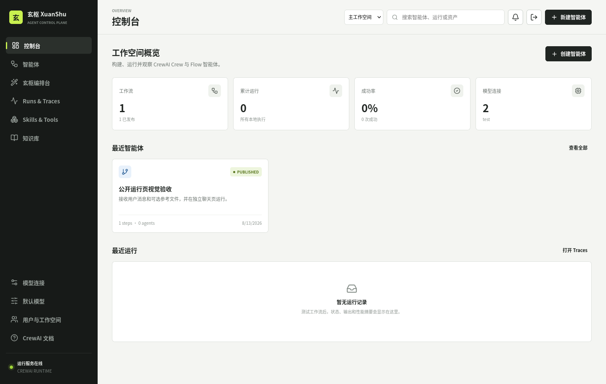
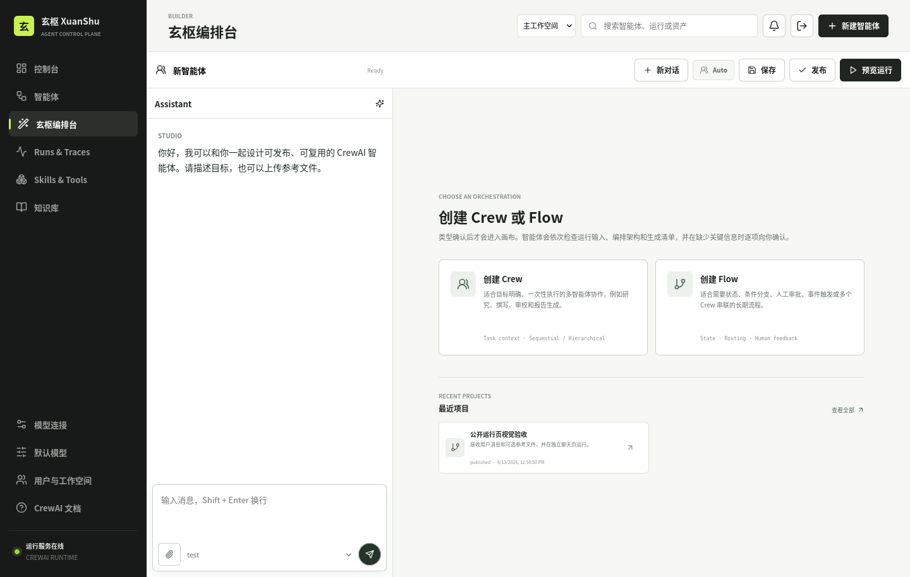
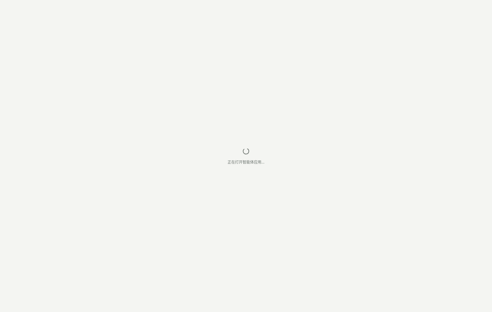
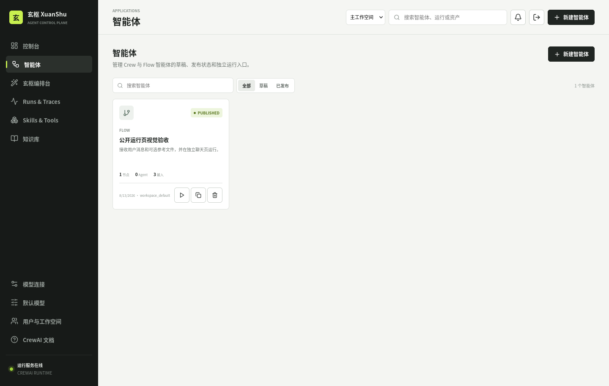
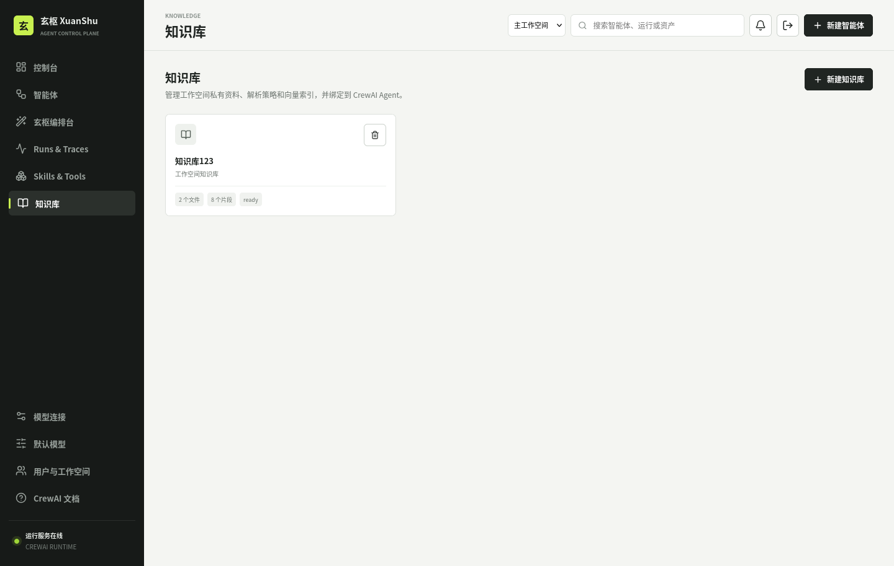
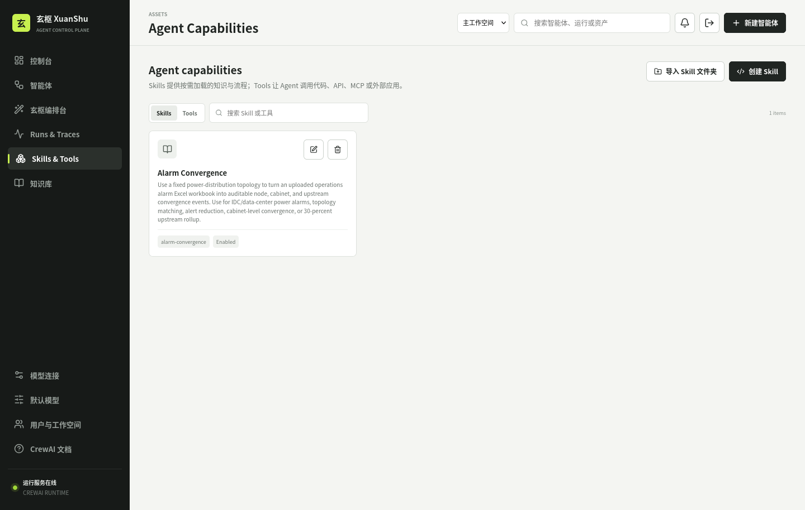
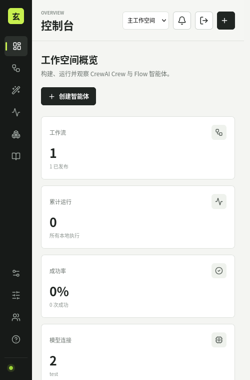
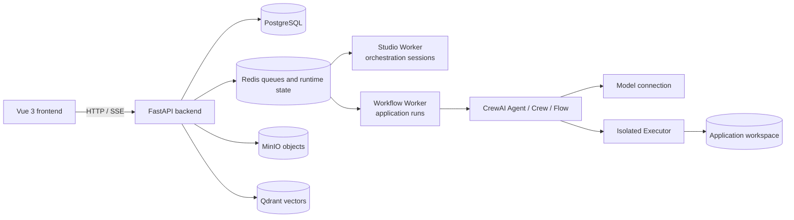

# XuanShu

[中文版](README.zh-CN.md) | English

[](LICENSE)

XuanShu is a multi-tenant CrewAI application platform for teams. It brings natural-language orchestration, visual canvas editing, model connections, Skills, Tools, knowledge bases, publishing, execution, and observability into one workspace.

Applications can be built as either Crews or Flows. Crews are suited to one-shot, sequential, or hierarchical multi-agent collaboration. Flows are designed for stateful business processes involving routing, human feedback, and multi-turn conversations. Both are executed by the native CrewAI runtime rather than being converted into temporary scripts.

## Features

- **Natural-language orchestration**: progressively produces an executable definition through discovery, input confirmation, architecture confirmation, generation, and validation.
- **Visual canvas editor**: directly add and connect Agent, Task, Crew, Router, Code, and human-approval nodes.
- **Crew and Flow support**: build sequential or hierarchical Crews, as well as Flows with explicit state, branching, approvals, and `ask_user` interactions.
- **Model connections**: manage providers, model names, Base URLs, API keys, timeouts, retries, and reasoning parameters per workspace.
- **Skills, Tools, and knowledge bases**: bind standard Skills, HTTP tools, remote MCP servers, isolated Python tools, Connected Apps, and vector knowledge bases to Agents.
- **Multi-turn execution**: only Agents with `ask_user` explicitly enabled can pause for user input; execution resumes in the same conversation from a persisted checkpoint.
- **Publishing and API access**: provide internal applications, anonymous public chat pages, and API-key-protected programmatic endpoints.
- **Execution observability**: inspect node status, final output, approvals, generated files, event streams, and Traces.
- **Isolated execution**: code runs in a separate executor container that can only access the current application's workspace; resources and credentials are isolated by workspace.

## Screenshots

### Workspace Dashboard



### Natural-Language Studio



### Application Run and Node Progress



### Agents, Knowledge, and Resources







A responsive mobile interface is also included:



## Architecture



| Service | Responsibility | Default container port |
| --- | --- | ---: |
| `frontend` | Vue/Vite development frontend or Nginx static site | 80 |
| `backend` | FastAPI, authentication, Studio, applications, and resource management | 8012 |
| `studio-worker` | Consumes orchestration jobs and persists stage progress | No exposed port |
| `worker` | Executes published Crews/Flows and persists checkpoints | No exposed port |
| `executor` | Isolated Python, Shell, and Skill script execution | 8020 (internal) |
| `postgres` | Users, workspaces, applications, runs, and events | 5432 (internal) |
| `redis` | Queues, locks, runtime state, and Composer Flow persistence | 6379 (internal) |
| `minio` | Uploaded files, generated artifacts, and Skill resources | 9000/9001 (internal) |
| `qdrant` | Knowledge-base vector index | 6333 (internal) |

PostgreSQL persists run ownership and checkpoints, while Redis handles queues and live runtime state. Workers use heartbeats to detect lost ownership. After a worker restart, completed nodes are skipped; nodes in `waiting_input` or `waiting_approval` are not executed again.

## Orchestration and Execution

1. Greetings and casual conversation receive a normal platform response and do not create an application.
2. Discovery begins only after the user clearly asks to create or modify an application and its intended purpose is sufficiently specific.
3. The platform asks only for unresolved decisions, such as one-shot versus multi-turn interaction, required Skills/Tools/knowledge bases, and Crew versus Flow. Decisions already present in the request are skipped.
4. Input confirmation defines the published input contract. Platform applications normally include a required long-text `message` field for the user's request, with file, number, Boolean, and JSON fields added only when needed.
5. Architecture confirmation defines Agent roles, Tasks, node dependencies, and variable sources. A downstream node may reference only confirmed published inputs or outputs from its upstream nodes.
6. The generation stage turns the design into an executable definition, validates variable contracts and resources, and corrects the generated manifest when review finds a problem.
7. Confirmation saves a draft. Publishing creates an immutable release snapshot, so active applications are unaffected by later draft edits.
8. Run requests enter a Redis queue. Workers execute them and persist node status, approvals, files, and event cursors.

### Choosing Crew or Flow

| Scenario | Recommended option |
| --- | --- |
| One-shot sequential collaboration such as research, writing, and review | `Crew` + `sequential` |
| A manager should delegate work through a hierarchy | `Crew` + `hierarchical` |
| Conditional branches, loops, or human approvals are required | `Flow` |
| The application must ask follow-up questions and pause/resume | `Flow`, or a Crew Agent with `ask_user` explicitly enabled |
| Several Crews must be chained together | `Flow` |

Multi-turn mode does not automatically convert every node into a Flow. Only an Agent bound to the platform `ask_user` tool can ask the user a question. Conversation messages are delivered through the platform message channel and are not treated as arbitrary custom run inputs.

## Quick Start with Docker

### 1. Prerequisites

You need Docker Engine 24+, Docker Compose v2, access to a chat-model API, and at least 4 GB of available memory. Eight GB is recommended while building dependencies.

### 2. Configure the Environment

```bash
cd xuanshu_platform
cp .env.example .env
```

At minimum, change these values for production:

```dotenv
POSTGRES_PASSWORD=<database-password>
MINIO_SECRET_KEY=<object-storage-password>
JWT_SECRET=<random-string-with-at-least-32-characters>
ENCRYPTION_KEY=<fernet-key>
ADMIN_PASSWORD=<administrator-password-with-at-least-12-characters>
EXECUTOR_SHARED_SECRET=<random-string-with-at-least-24-characters>
OPENAI_API_KEY=<optional-default-model-api-key>
OPENAI_MODEL=gpt-4o-mini
```

The `OPENAI_*` variables configure only the initial default model. Other providers can be added after startup from **Model Connections** using their Base URL, model name, and credentials. Never commit credentials to Git or expose them in screenshots or logs.

### 3. Start the Stack

```bash
docker compose up --build -d
docker compose ps
```

Default endpoints:

- Frontend: <http://localhost:8012>
- Health check: <http://localhost:18112/api/health>
- OpenAPI: <http://localhost:18112/docs>

On first startup, XuanShu initializes the database, workspace directories, and administrator account. Credentials come from `ADMIN_USERNAME` and `ADMIN_PASSWORD`; that account automatically owns the primary workspace.

Production data is stored inside the project under `data/postgres`, `data/redis`, `data/minio`, `data/qdrant`, and `data/workspaces`. These directories are ignored by Git. The Compose `data-init` service creates them and sets their permissions on first startup. Do not commit runtime data to GitHub.

### 4. First Run

1. Sign in with the administrator account.
2. Add or test a model connection and select the default model.
3. Import a Skill, create a Tool under **Skills & Tools**, or upload documents to a knowledge base and wait for indexing to complete.
4. Open **Agent Editor** or **XuanShu Studio**, then create a Crew/Flow with natural language or the canvas.
5. Confirm inputs, Agents, Tasks, dependencies, and resources; save the draft and publish it.
6. Test the application from **Run Agents** or its public URL.

## Development Mode

The development override mounts source code into the containers while reusing the data volumes from the production Compose definition:

```bash
docker compose -f docker-compose.yml -f docker-compose.dev.yml up -d --no-build
```

Restart backend services after changing the backend, Worker, or executor:

```bash
docker compose -f docker-compose.yml -f docker-compose.dev.yml \
  restart backend worker studio-worker executor
```

The frontend uses Vite hot reload, and its dependencies are stored under `data/frontend-node-modules`. Rebuild the frontend when its dependencies change:

```bash
docker compose -f docker-compose.yml -f docker-compose.dev.yml \
  up -d --build frontend
```

Follow logs with:

```bash
docker compose logs -f backend
docker compose logs -f studio-worker worker
docker compose logs -f executor
```

Stop services while retaining persisted data:

```bash
docker compose down
```

Do not run `docker compose down -v` without a backup. It removes PostgreSQL, Redis, MinIO, Qdrant, and application-workspace data.

## Public Application API

A published application provides two entry points:

- `/public/{public_token}`: anonymous public chat page.
- `/api/v1/apps/{public_token}`: API-key-protected programmatic interface.

### Upload a File and Start a Run

```bash
curl -X POST "http://localhost:18112/api/v1/apps/<PUBLIC_TOKEN>/files" \
  -F "file=@./contract.docx"

curl -X POST "http://localhost:18112/api/v1/apps/<PUBLIC_TOKEN>/runs" \
  -H "Authorization: Bearer xsk_<API_KEY>" \
  -H "Content-Type: application/json" \
  -d '{
    "inputs": {
      "message": "Review this contract, focusing on payment, breach, and expiration clauses."
    },
    "files": {
      "contract_files": ["<UPLOAD_ID>"]
    },
    "user_id": "client-user-001",
    "conversation_id": "customer-session-001"
  }'
```

Keys under `inputs` and `files` must match the English variable names in the published input contract. `user_id` and `conversation_id` may be omitted on the first request. To resume a multi-turn application after `waiting_input`, continue with the same conversation.

| Method | Path | Purpose |
| --- | --- | --- |
| `GET` | `/api/v1/apps/{token}` | Get the public application description and input contract |
| `POST` | `/api/v1/apps/{token}/files` | Upload a temporary file |
| `POST` | `/api/v1/apps/{token}/runs` | Create a run |
| `GET` | `/api/v1/apps/{token}/runs/{run_id}` | Get status, node outputs, and files |
| `GET` | `/api/v1/apps/{token}/runs/{run_id}/events` | Stream events with SSE |
| `POST` | `/api/v1/apps/{token}/runs/{run_id}/approval` | Submit an approval decision |
| `GET` | `/api/v1/apps/{token}/runs/{run_id}/files/{path}` | Download a generated file |

See [`docs/API.md`](docs/API.md) for the complete API reference.

## Resources and Execution Security

- Applications, Agents, Tasks, inputs, runs, model connections, and resources belong to a workspace.
- Model API keys and HTTP/MCP tokens and headers are encrypted at rest; management APIs never return plaintext credentials.
- Skills use the standard package layout and are loaded by Agents only when required.
- Python, Shell, and Skill scripts run only through the executor, whose workspace root is `/var/lib/xuanshu/workspaces`.
- By default, the executor has a read-only root filesystem, dropped capabilities, no privilege escalation, and CPU, memory, process-count, and execution-time limits.
- MCP connections support only remote Streamable HTTP or SSE; stdio cannot bypass the isolation boundary.
- Uploaded objects, external sessions, and conversation history are cleaned according to the retention settings in `.env`.
- Published applications execute immutable release snapshots; editing a draft does not alter an existing release.

Enable code execution only for trusted Agents, and restrict the Skills, Tools, and environment variables available to them.

## Repository Layout

```text
xuanshu_platform/
├── src/xuanshu_platform/
│   ├── api.py              # FastAPI routes, auth, Studio, and public API
│   ├── composer.py         # Persistent orchestration Flow and stage state
│   ├── runtime.py          # Crew/Flow runtime, dependencies, outputs, checkpoints
│   ├── model_runtime.py    # Model settings, invocation parameters, output parsing
│   ├── db.py               # PostgreSQL SQLAlchemy models
│   ├── persistence.py      # Application graph storage and release snapshots
│   ├── knowledge.py        # Knowledge parsing, chunking, and retrieval
│   ├── resources.py        # Materialization of Skills, Tools, and app resources
│   ├── tools/builtin.py    # ask_user, file, spreadsheet, and isolated-run tools
│   └── builtin_resources/  # Built-in Skills and Tool definitions
├── worker/                 # Application Worker and Studio Worker
├── executor/               # Separate isolated execution service
├── frontend/src/           # Vue 3, Pinia, and Vue Router frontend
├── docs/API.md             # Public API reference
├── docs/screenshots/       # README screenshots
├── data/                   # Docker persistent data (runtime content is ignored)
├── docker-compose.yml      # Production Compose definition
├── docker-compose.dev.yml  # Source-mounted development override
└── pyproject.toml          # Python dependencies and CrewAI Flow configuration
```

## Deployment Checks

The open-source package does not include test code or local development caches. After deployment, verify the services with:

```bash
curl http://localhost:18112/api/health
docker compose ps
docker compose logs --tail=100 backend worker studio-worker executor
```

## Troubleshooting

### Source Changes Do Not Appear

Make sure the development override is active:

```bash
docker compose -f docker-compose.yml -f docker-compose.dev.yml up -d --no-build
```

Backend and Worker source changes require a restart. Dependency, Dockerfile, and frontend dependency changes require a rebuild.

### A Run Remains Queued or Produces No Node Output

Inspect the `backend`, `worker`, `studio-worker`, and `executor` logs. Verify that Redis, PostgreSQL, MinIO, Qdrant, and executor are healthy, then check the model Base URL, API key, timeout, and model name.

### Missing Input Variables

Input keys must match the English variable names in the published release. Verify `message`, file fields, and required fields. Save and publish again after editing the canvas.

### A Multi-Turn Application Does Not Ask Questions

Verify that the application uses `multi_turn` and that an Agent is explicitly bound to `ask_user`. Selecting Flow alone does not enable user interaction.

### Generated Files Cannot Be Found

Files must be written under `$XUANSHU_WORKSPACE`, where the platform collects executor artifacts. Do not hard-code a host path or return only a local path as text.

### Database Migration or Credential Errors

`schema-init` initializes and migrates the database schema. Weak production credentials are rejected during initialization. After changing `.env`, restart the affected services; do not delete data volumes as a configuration workaround.

## Documentation

- [`docs/API.md`](docs/API.md): public API, conversations, SSE, approvals, and file downloads.
- [`docs/LEGACY_PARITY.md`](docs/LEGACY_PARITY.md): feature migration matrix and runtime semantics.
- [CrewAI documentation](https://docs.crewai.com/): Agent, Task, Crew, Flow, Skill, and Tool reference.

## License and Deployment Notes

This project is licensed under the [Apache License 2.0](LICENSE).

Before exposing a deployment to the internet, review the compliance requirements for model providers, uploaded files, knowledge-base content, Traces, and logs. Enable HTTPS at the reverse proxy, restrict access to administrative endpoints, and configure backups.
