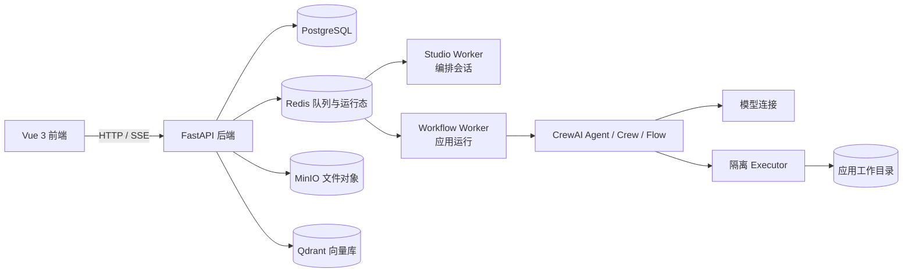

# 玄枢 XuanShu

玄枢是一个面向团队的多租户 CrewAI 智能应用平台，把自然语言编排、画布编辑、模型连接、Skills、Tools、知识库、发布运行和运行观测放在同一个工作空间中。

生成的应用既可以是 Crew，也可以是 Flow。Crew 适合一次性、顺序或层级的多智能体协作；Flow 适合带状态、路由、人工反馈和多轮对话的业务流程。两者都由 CrewAI 原生运行时执行，而不是转换成临时脚本。

## 功能概览

- **自然语言编排**：按信息收集、输入确认、架构确认和生成校验逐步形成可运行定义。
- **画布编辑**：直接添加和连接 Agent、Task、Crew、Router、Code、人工审批等节点。
- **Crew 与 Flow**：支持顺序/层级 Crew，以及显式状态、分支、审批和 `ask_user` 的 Flow。
- **模型连接**：按工作空间管理供应商、模型、Base URL、API Key、超时、重试和思考参数。
- **Skills、Tools、知识库**：为 Agent 绑定标准 Skill、HTTP/远程 MCP/隔离 Python/Connected App 工具和向量知识库。
- **多轮运行**：只有显式启用 `ask_user` 的 Agent 才会暂停等待用户；恢复时复用同一会话和运行检查点。
- **发布与调用**：支持内部应用、匿名公开聊天页和带 API Key 的程序接口。
- **运行观测**：查看节点状态、最终输出、审批、交付文件、事件流和 Trace。
- **安全执行**：代码在独立 executor 容器中运行，仅能访问当前应用工作目录；资源和凭据按工作空间隔离。

## 界面预览

### 工作空间控制台


### 自然语言编排台


### 应用运行与节点进度


### Agent、知识库和资源


移动端也提供响应式界面：


## 系统架构



| 服务 | 作用 | 默认容器端口 |
| --- | --- | ---: |
| `frontend` | Vue/Vite 开发前端或 Nginx 静态站点 | 80 |
| `backend` | FastAPI API、认证、Studio、应用和资源管理 | 8012 |
| `studio-worker` | 消费编排任务并保存阶段进度 | 无外部端口 |
| `worker` | 执行已发布 Crew/Flow 并保存检查点 | 无外部端口 |
| `executor` | 隔离执行 Python、Shell 和 Skill 脚本 | 8020（内部） |
| `postgres` | 用户、工作空间、应用、运行和事件持久化 | 5432（内部） |
| `redis` | 队列、锁、运行态和编排 Flow 持久化 | 6379（内部） |
| `minio` | 上传文件、生成文件和 Skill 资源存储 | 9000/9001（内部） |
| `qdrant` | 知识库向量索引 | 6333（内部） |

PostgreSQL 负责运行领取和检查点持久化，Redis 负责队列与运行态，Worker 通过心跳识别失联。Worker 重启后会跳过已完成节点；`waiting_input` 和 `waiting_approval` 不会重复执行已完成节点。

## 编排与运行流程

1. 普通问候或闲聊只由平台回复，不会创建智能应用。
2. 当需求明确表达创建/修改应用且用途足够清楚后，进入信息收集阶段。
3. 系统只询问尚未确定的关键内容，例如单轮/多轮交互、Skill/Tool/知识库和 Crew/Flow 类型；用户已经说清楚的内容会跳过。
4. 输入确认阶段生成发布后的输入契约。平台应用通常包含必填的 `message` 长文本变量，用于承载用户需求描述；文件、数字、布尔和 JSON 按需增加。
5. 架构确认阶段确定 Agent 角色、Task、节点依赖和变量来源。下游节点只能引用已确认的上游输出或发布输入。
6. generation 阶段落实为可运行定义，执行变量契约和资源校验，必要时根据审查结果修正清单。
7. 用户确认后保存草稿；点击发布生成不可变发布快照。运行中的应用读取发布快照，不受后续草稿编辑影响。
8. 运行请求进入 Redis 队列，由 Worker 执行并持久化节点状态、审批、文件和事件游标。

### Crew 与 Flow 如何选择

| 场景 | 建议 |
| --- | --- |
| 一次性完成研究、写作、审查等顺序协作 | `Crew` + `sequential` |
| 需要负责人分配任务或层级管理 | `Crew` + `hierarchical` |
| 需要条件分支、循环、人工审批 | `Flow` |
| 需要多轮追问并暂停恢复 | `Flow`，或在 Crew 的 Agent 上显式启用 `ask_user` |
| 需要多个 Crew 串联 | `Flow` |

多轮模式不是自动把所有节点变成 Flow；只有绑定平台 `ask_user` 的 Agent 才能提问。平台消息通过会话通道传入，不会被错误地当作用户自定义运行输入变量。

## 快速开始（Docker）

### 1. 准备环境

需要 Docker Engine 24+、Docker Compose v2、可访问的聊天模型 API，以及至少 4 GB 可用内存（构建依赖建议 8 GB）。

### 2. 创建配置

```bash
cd xuanshu_platform
cp .env.example .env
```

生产环境至少修改：

```dotenv
POSTGRES_PASSWORD=<数据库密码>
MINIO_SECRET_KEY=<对象存储密码>
JWT_SECRET=<至少32字符的随机密钥>
ENCRYPTION_KEY=<Fernet 密钥>
ADMIN_PASSWORD=<至少12字符的管理员密码>
EXECUTOR_SHARED_SECRET=<至少24字符的随机密钥>
OPENAI_API_KEY=<可选：默认模型 API Key>
OPENAI_MODEL=gpt-4o-mini
```

`OPENAI_*` 只是默认模型配置；其他供应商可以启动后从“模型连接”添加 Base URL、模型名和密钥。不要把密钥提交到 Git、截图或日志。

### 3. 启动

```bash
docker compose up --build -d
docker compose ps
```

默认地址：

- 前端：<http://localhost:8012>
- 健康检查：<http://localhost:18112/api/health>
- OpenAPI：<http://localhost:18112/docs>

第一次启动会初始化数据库、工作目录和管理员用户。账号来自 `ADMIN_USERNAME`、`ADMIN_PASSWORD`，并自动拥有主工作空间。

生产数据直接保存在项目目录下：`data/postgres`、`data/redis`、`data/minio`、`data/qdrant` 和 `data/workspaces`。这些目录已加入 Git 忽略规则，Compose 的 `data-init` 服务会在首次启动时自动创建并设置权限；不要把运行数据提交到 GitHub。

### 4. 第一次使用

1. 登录管理员账号。
2. 在“模型连接”添加或测试模型，并设置默认模型。
3. 在“Skills & Tools”导入 Skill、创建工具，或在“知识库”上传文件并等待索引完成。
4. 进入“智能体编辑”或“玄枢编排台”，使用自然语言或画布创建 Crew/Flow。
5. 确认输入、Agent、Task、依赖和资源，保存草稿并点击“发布”。
6. 通过“运行智能体”或公开 URL 试运行。

## 开发模式

开发覆盖配置把源码映射进容器，数据卷仍复用生产 Compose 定义：

```bash
docker compose -f docker-compose.yml -f docker-compose.dev.yml up -d --no-build
```

修改后端、Worker 或 executor 后重启：

```bash
docker compose -f docker-compose.yml -f docker-compose.dev.yml \
  restart backend worker studio-worker executor
```

前端使用 Vite 热更新，依赖安装在项目内的 `data/frontend-node-modules`；依赖变化时重新构建：

```bash
docker compose -f docker-compose.yml -f docker-compose.dev.yml \
  up -d --build frontend
```

日志：

```bash
docker compose logs -f backend
docker compose logs -f studio-worker worker
docker compose logs -f executor
```

停止服务但保留数据卷：

```bash
docker compose down
```

不要在没有备份时使用 `docker compose down -v`，它会删除 PostgreSQL、Redis、MinIO、Qdrant 和应用工作目录数据。

## 公开应用 API

发布应用后有两个入口：

- `/public/{public_token}`：无需登录的匿名聊天页面。
- `/api/v1/apps/{public_token}`：使用应用 API Key 的程序接口。

### 上传并运行

```bash
curl -X POST "http://localhost:18112/api/v1/apps/<PUBLIC_TOKEN>/files" \
  -F "file=@./合同.docx"

curl -X POST "http://localhost:18112/api/v1/apps/<PUBLIC_TOKEN>/runs" \
  -H "Authorization: Bearer xsk_<API_KEY>" \
  -H "Content-Type: application/json" \
  -d '{
    "inputs": {
      "message": "请审查这份合同，重点关注付款、违约和到期条款"
    },
    "files": {
      "contract_files": ["<UPLOAD_ID>"]
    },
    "user_id": "client-user-001",
    "conversation_id": "customer-session-001"
  }'
```

`inputs` 和 `files` 的键必须使用发布版本中的英文变量名。首次请求可省略 `user_id` 和 `conversation_id`；多轮应用在 `waiting_input` 后继续使用同一会话即可恢复。

| 方法 | 路径 | 用途 |
| --- | --- | --- |
| `GET` | `/api/v1/apps/{token}` | 公开应用描述和输入契约 |
| `POST` | `/api/v1/apps/{token}/files` | 上传临时文件 |
| `POST` | `/api/v1/apps/{token}/runs` | 创建运行 |
| `GET` | `/api/v1/apps/{token}/runs/{run_id}` | 查询状态、节点输出和文件 |
| `GET` | `/api/v1/apps/{token}/runs/{run_id}/events` | SSE 事件流 |
| `POST` | `/api/v1/apps/{token}/runs/{run_id}/approval` | 提交审批 |
| `GET` | `/api/v1/apps/{token}/runs/{run_id}/files/{path}` | 下载交付文件 |

完整接口见 [`docs/API.md`](docs/API.md)。

## 资源与执行安全

- 应用、Agent、Task、输入、运行、模型和资源均归属于工作空间。
- 模型 API Key、HTTP/MCP token 和 headers 加密保存；管理 API 不返回密钥原文。
- Skill 使用标准 package 目录并由 Agent 按需加载。
- Python、Shell 和 Skill 脚本只通过 executor 执行，工作目录固定为 `/var/lib/xuanshu/workspaces`。
- executor 默认只读根文件系统、丢弃 capabilities、禁止提权，并限制 CPU、内存、进程数和执行时间。
- MCP 只支持远程 Streamable HTTP 或 SSE，不提供 stdio 绕过边界。
- 上传对象、外部会话和对话历史按 `.env` 保留策略清理。
- 发布应用读取发布快照；草稿编辑不会改变已发布版本。

启用代码执行时，请只绑定给可信 Agent，并限制 Skill、Tool 和环境变量权限。

## 项目结构

```text
xuanshu_platform/
├── src/xuanshu_platform/
│   ├── api.py              # FastAPI 路由、认证、Studio、公开 API
│   ├── composer.py         # 持久化编排 Flow 与阶段状态
│   ├── runtime.py          # Crew/Flow 运行时、依赖、输出和检查点
│   ├── model_runtime.py    # 模型配置、调用参数和输出解析
│   ├── db.py               # PostgreSQL SQLAlchemy 模型
│   ├── persistence.py      # 应用图读写与发布快照
│   ├── knowledge.py        # 知识库解析、切片和检索
│   ├── resources.py        # Skill、Tool 和应用资源物化
│   ├── tools/builtin.py    # ask_user、文件和隔离执行工具
│   └── builtin_resources/  # 平台内置 Skill 与工具
├── worker/                 # 应用 Worker 和 Studio Worker
├── executor/               # 独立隔离执行服务
├── frontend/src/           # Vue 3 + Pinia + Vue Router
├── docs/API.md             # 公开 API 参考
├── docs/screenshots/       # README 界面截图
├── data/                   # Docker 持久化数据（不提交实际内容）
├── docker-compose.yml      # 生产 Compose
├── docker-compose.dev.yml  # 源码映射开发覆盖配置
└── pyproject.toml          # Python 依赖和 CrewAI Flow 配置
```

## 部署检查

项目发布包不包含测试代码和本地开发缓存。部署后可用以下命令确认服务状态：

```bash
curl http://localhost:18112/api/health
docker compose ps
docker compose logs --tail=100 backend worker studio-worker executor
```

## 常见问题

### 修改源码后没有变化

确认使用开发覆盖文件：

```bash
docker compose -f docker-compose.yml -f docker-compose.dev.yml up -d --no-build
```

后端和 Worker 修改后需要重启；依赖、Dockerfile 或前端依赖变化需要重新构建。

### 运行停在队列或没有节点输出

查看 `backend`、`worker`、`studio-worker` 和 `executor` 日志，确认 Redis、PostgreSQL、MinIO、Qdrant 和 executor healthy，并检查模型 Base URL、API Key、超时和模型名。

### 缺少输入变量

输入键必须匹配发布版本的英文变量名。确认 `message`、文件变量和必填项；编辑画布后需要重新保存并发布。

### 多轮应用没有提问

确认应用为 `multi_turn`，且某个 Agent 显式绑定 `ask_user`。仅选择 Flow 不会自动开启用户提问。

### 生成文件找不到

文件必须写入 `$XUANSHU_WORKSPACE`，平台从 executor 工作目录收集交付物。不要硬编码宿主机路径，也不要只在文本中返回本地路径。

### 数据迁移或密钥错误

`schema-init` 负责初始化和迁移数据库结构；生产弱密钥会在初始化时被拒绝。修改 `.env` 后重启相关服务，不要删除数据卷来“解决”配置问题。

## 相关文档

- [`docs/API.md`](docs/API.md)：公开 API、会话、SSE、审批和文件下载。
- [`docs/LEGACY_PARITY.md`](docs/LEGACY_PARITY.md)：功能迁移矩阵与运行语义。
- [`AGENTS.md`](AGENTS.md)：CrewAI 版本、代码模式和开发约束。
- [CrewAI 官方文档](https://docs.crewai.com/)：Agent、Task、Crew、Flow、Skill 和 Tool 参考。

## 许可证与部署提示

当前仓库未声明开源许可证。部署到公网前，请确认模型供应商、上传文件、知识库内容、Trace 和日志的合规要求，并在反向代理层启用 HTTPS、限制管理端访问和配置备份策略。
